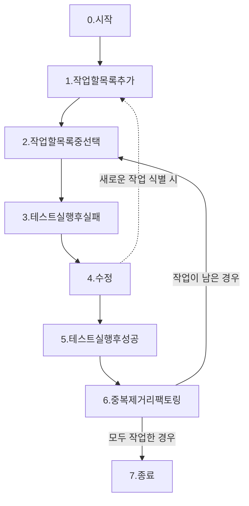

# [202309] 테스트 주도 개발

### TDD

- 단순하게 시작하고
- 자동화된 테스트를 만들고
- 새로운 설계 결정을 한 번에 하나씩 도입하기 위해 리팩토링할 준비가 될 것이다.

*26p*

<aside>
💡 Clean code that works

</aside>

### 깨끗하게 동작하는 코드!

- 예측 가능한 개발 방법.
- 코드가 가르쳐주는 교훈을 학습할 기회를 얻게 됨.
- 작성하는 동안 기분이 좋음.

*21p*

### TDD의 단순 규칙 2가지

1. 자동화된 테스트가 실패할 경우에만 새로운 코드를 작성.
2. 중복을 제거.

```java
* 매 결정사항(상속을 쓸지 말지 등의)에 대해 피드백을 제공하는 실행가능한 코드를 기반으로 설계
* 개발 환경은 작은 변화에도 빠르게 반응할 수 있어야 함
* 테스트를 쉽게 만들려면 반드시 응집도는 높고 결합도는 낮은 컴포넌트들로 구성되게끔 설계
```

*22p*

### TDD 프로그래밍 순서

1. 빨강: 실패하는 작은 테스트 작성.
2. 초록: 어떻게든 빨리 통과만 하게 코드를 작성. 이를 위해 어떤 죄악을 저질러도 좋음.
3. 리팩토링: 일단 테스트를 통과하게하는 과정에서 발생된 모든 중복 제거.

*23p*

### 왜 위와 같은 작은 단계로 나누어 진행해야하는가? ⇒ 용기

- TDD는 개발간 나타나는 두려움을 관리하는 방법.

```java
두려움은
* 우리를 망설이게 만듬
* 우리가 커뮤니케이션을 덜 하게 만듬
* 우리가 피드백 받는 것을 피하도록 만듬
* 우리를 까다롭게 만듬
```

⇒ 두려움은 어떠한 것도 프로그래밍에 도움이 되지 않음.

*24p*

### TDD 순서도

*51p*



(3) 테스트실행후실패

- 항상 먼저 구현보다 테스트를 먼저 해야한다는 것을 사고하자 *94p*

(4) 수정

- 수정간 발견되는 새로운 작업은 작업할 목록에 추가하고 넘어간다. *43p*
  단, 짧은 중단이 필요한 경우 진행하기도 한다. 하지만 중단은 또다른 중단을 부르기 때문에 꼭 짧은 중단의 경우에만 작업하자. *96p*
- 더 많은 동기가 있기 전에는(테스트가 작성되기전) 더 많은 설계를 도입하지 않는다. *84p*

(6) 중복제거리팩토링

- 테스트 코드와 코드 사이의 결합도를 낮추기 위해, 신규 기능을 활용해 중복을 제거하는 시나리오. *68p*
  이 경우 다른 기능(테스트)을 이용했기 때문에, 해당 기능(테스트)의 실패가 전파 수 있음을 인지하자.
- (4)수정 에서 약간만(어떻게든) 수정해 (5) 테스트실행 후 성공해도 되는 이유는 마지막에 (6) 중복제거 단계가 있기 때문이다. *71p*
- 동일한 메서드를 가지는 하위 메서드를 공통 상위 클래스로 끌어올려 중복을 제거하는 시나리오 *88p*

### TDD에서의 중복제거

<aside>
💡 테스트와 코드 사이에 존재하는 의존성이 발생한다면, 한쪽을 수정하면 반드시 다른 한쪽도 수정해야한다. 이 때 의존성이 문제 그 자체라면, 중복은 문제의 징후다. 프로그래밍에서는 이 문제의 징후만 수정해줘도 의존성이 제거된다.

따라서 TDD의 단순 2원칙에서 강조하듯 중복을 제거함으로써 코드와 테스트 간의 의존성이 깊어지는 상황을 방지한다.
(추가적으로 다음 테스트로 진행하기 전 중복을 제거함으로써, 오직 한 곳 수정을 통해 다음 테스트도 통과할 수 있도록 만드는 목적도 있다)

</aside>

*48p*

### 적절한 테스트가 없는 환경에서 TDD를 해야하는 경우

- 리팩토링 과정에서 실수를 했음에도 불구하고 테스트가 여전히 통과할 수도 있음.
    - 개발자는 결국 두려움을 갖게되고 리팩토링에 소극적이된다.
        - 리팩토링에 소극적인 코드는 설계의 질이 저하되고 곧 해고될 것이다

⇒ 리팩토링을 하기전에 테스팅부터 하자.

*78p*